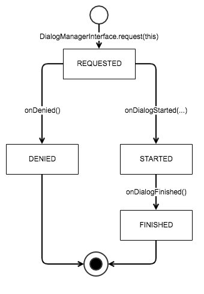
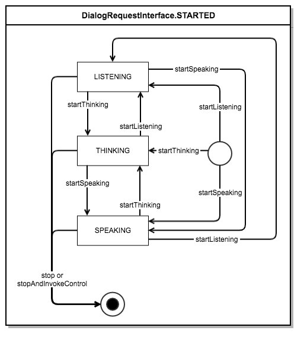
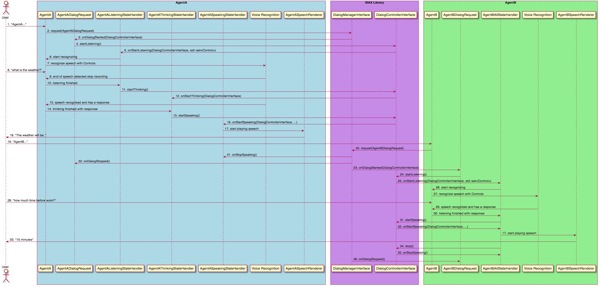
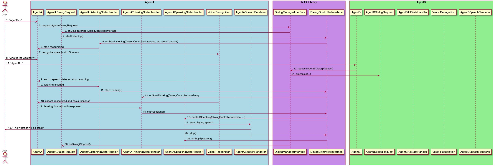

# Integrating an Agent with MAX Library
## Introduction
An Agent uses the Multi Agent Experience (MAX) Library v0.4.0 to collaborate with other Agents to create a cohesive experience for customers. Each part of MAX Library helps facilitate this by providing tools Agents can use to help enable a multi-agent experience. The library also surfaces multi-agent features such as client-side support for Universal Device Commands and Agent Transfers, which enable experiences that are not possible without device side inter-agent coordination. This document describes the capabilities an Agent has available through MAX the MAX Library, as well as suggestions of what any Agent will have to consider during integration.

### Terms
Many of the concepts in this document are defined in the [VII Multi-Agent Design Guide](https://developer.amazon.com/en-US/alexa/voice-interoperability/design-guide) but also expanded upon in this document. For concepts which are explored in depth in this document, there will be a reference to the relevant section. For other terms see the [Glossary](Glossary.md).

## What is an Agent
 The [VII Multi-Agent Design Guide](https://developer.amazon.com/en-US/alexa/voice-interoperability/design-guide) defines an Agent as: the digital “person” that the customer interacts with through conversation (turn taking). However the MAX library does not interact with this entire ‘person’. When the MAX library references an Agent, it means the device side component that implements `Agent` (see Appendix A: Code 1). Creating an Agent in this context therefore means any object which implements this interface.

The `Agent` interface contains handlers for each invocation type for the Agent, including being invoked by an action button, a wake word, or via an agent transfer. Each of these invocation types is optional.

## Preparing for Integration
This section is about identifying the parts of your existing Agent which may be affected by integration with MAX Library. The rest of the document dives deep into how each of these integrations could be done.

As an Agent developer, it is best to think of the MAX Library as primarily a focus management library. Like any focus management, requests are made before starting an interaction to ensure other interactions are not conflicting with yours. These requests may occasionally be denied, and when granted can occasionally be interrupted before they are completed. In addition to this, the MAX Library is also used to enable specific multi-agent features. Many of these features are only available when an Agent has focus.

Which parts of your Agent will need to request focus? Any interaction which records user speech, or plays audio should be identified, and are candidates for integrating with the MAX Library. For each of these features the first choice before requesting focus is whether your interaction is a Dialog or an Activity. Dialogs are reserved for interactions between the user through speech and the Agent through its speech. All other interactions are Activities.

Using Dialogs and Activities for your features will coordinate your audio interactions with any other Agents on the same device also using MAX Library. The next step of integration is to identify which of these also require an Experience (explained further in the **Experiences** section below). When a Dialog or Activity is active for your Agent, they will have access to setting Experiences with the MAX Library. These Experiences are shared with the Device along with any other Experiences set by other Agents. The Device can then represent each Agent correctly in its Attention System.

The final set of features made available when a Dialog or Activity is active is access to Universal Device Commands (UDCs). Dialogs and Activities will give your Agent access to all UDCs available, registries to make your own controls available to others, and APIs to invoke the controls of others.

If your Agent uses a wake word, see the **Integrating a Wake Word Engine** document for guidance on how to integrate the engine, and your Agent with it.

Lastly, while thinking of MAX Library as a focus management system is useful, it is not necessarily the only focus management system on your device. For the best experience, it is recommended you use MAX Library to first establish multi-agent focus, then use any other focus management system afterwards.

## Registering an Agent
Agents must be registered to use MAX APIs and be part of the multi-agent experience. To register, simply use the registration APIs on the `MultiAgentManager`. This either must be created, or is given to you by some other partner in the multi-agent software. Typically the Device is registering the Agents, and more detail about registration is found in the [Integrating a Device with MAX Library](Integrating_A_Device_With_MAX_Library.md) document.

Agents will remain registered until the application terminates or the Agent is manually deregistered using `MultiAgentManager`.

## Agent Invocation
### Wake Word
There are different options for how wake words can be used to invoke Agents. An example of this is included in the MAX Toolkit Sample Application and documented in [Overview of MAX Sample Application and Multiple Wake Word Engines](Overview_Of_MAX_Sample_Application_And_Multiple_Wake_Word_Engines.md)

### All Other Invocation Types
A device may have multiple means of invoking any Agent. This can range from dedicated hardware buttons or software buttons to novel inputs specific to the device type. Each of these invocations are implemented by the application and are all expected to be handled by the `Agent::handleOnTapDetected`.

## MAX Library APIs
### Dialogs
A Dialog is the lifecycle of a conversation between a user and an Agent, and an Agent must request a Dialog **any time the user or Agent wants to speak**. This lifecycle can be in one of three states: `LISTENING`, `THINKING`, and `SPEAKING` each of which should be handled by the Agent. Only one Dialog is allowed to be active at any time across all Agents, and there are clear rules about when it can and cannot be interrupted by new Dialog requests(see **Barge-In** section below). One important side effect of starting a Dialog is any active Activities, across all Agents, will be notified that they are in the BACKGROUND state while the user is doing a more important task. The MAX library exposes the `DialogManagerInterface` API for Agents to use Dialogs.

### Requesting a Dialog
To start a Dialog, a request is made to the `DialogManagerInterface`. This is a request because not all Dialogs will be started, some will be denied. A request for a Dialog is denied if an existing Dialog is already in `LISTENING` or `THINKING` state with your Agent or another Agent. This is to prevent any experiences where an Agent interrupts what the user is doing (more detail on how this relates to the Barge-In features is discussed next). To make a request, an implementation of  `DialogRequestInterface` (see Appendix A: Code 2 for a reference) is used with `DialogManagerInterface`. The `DialogRequestInterface` is itself a lifecycle used to track whether or not the request was denied, and if a started Dialog is still active or finished.

#### DialogRequestInterface Lifecycle


For example here is how the Computer Agent both implements the `DialogRequestInterface` and uses it to request Dialogs.

#### Implementing DialogRequestInterface

From UserDialogRequest.h
```C++
//...

class UserDialogRequest : public multiAgentExperience::agent::dialog::DialogRequestInterface {
//...
};

//...
```
From UserDialogRequest.cpp
```C++
//...
void UserDialogRequest::onDenied(const std::string& denialMessage) {
    /*
    * Computer Agent has nothing to clean up here, but your Agent may
    * need to do so.
    */
}

void UserDialogRequest::onDialogStarted(std::shared_ptr<DialogControllerInterface> controller) {
    /*
    * The dialog is started, and since it is a 'user' initiated
    * Dialog request,
    * we immediately start listening.
    */
    controller->startListening();
}

void UserDialogRequest::onError(const std::string& errorMessage) {
    /*
    * Errors give messages to help understand what happened when
    * something is wrong with the Dialog or request. None of these
    * errors are recoverable, the message is included to help with
    * debugging.
    */
}

void UserDialogRequest::onDialogStopped() {
    /*
    * Computer Agent has nothing to clean up here, but your Agent may
    * need to do so.
    */
}
//...
```
From Computer.cpp
```C++
//...
void Computer::handleOnWakeWordDetected() {
    auto userDialogRequest = std::make_shared<UserDialogRequest>();
    m_dialogManager->request(userDialogRequest);
}
//...
```

Once the `DialogRequestInterface` is `DENIED` or `FINISHED`, the request is done and must not be reused.


### Controlling a Started Dialog
After a Dialog is started it can transition between the `LISTENING`, `THINKING` and `SPEAKING` states of the Dialog. To transition to these states MAX provides a `DialogControllerInterface` (see Appendix A: Code 3). The first transition happens in response to `DialogRequestInterface::onDialogStarted`, which provides a `DialogControllerInterface` for the new Dialog. Each state is handles by a Dialog State Handler, which are also given the same `DialogControllerInterface` to continue controlling the current Dialog (Dialog State Handlers are expanded on next). This controller contains all APIs for changing the state of a Dialog as well as some other related Dialog features. The Dialog lifecycle which can be used with this controller is as follows:



### Dialog State Handlers
 By default there is nothing which handles Dialog states. Transitioning to any state without a previously registered handler will result in an error in `DialogRequestInterface` and the Dialog will be finished. Therefore the Agent must register a handler for the states it will use in a Dialog. There are handlers for each state: `ListeningStateHandlerInterface`, `ThinkingStateHandlerInterface`, and `SpeakingStateHandlerInterface`. These are each set using the `DialogManagerInterface`.

### Registering Handlers
There are two recommended models for registering the handlers: once for all Dialogs or once per started Dialog (a combination of these approaches is also possible). The ‘right’ way to do so will be up to the Agent using the handlers.

Either way the **registration** of the handlers requires a `DialogManagerInterface` and the handlers you are registering. For example:

```C++
// Registration
dialogManager->setListeningHandler(listeningHandler);
dialogManager->setThinkingHandler(thinkingHandler);
dialogManager->setSpeakingHandler(speakingHandler);

// or
dialogManager->setAllHandlers(
    listeningHandler,
    thinkingHandler,
    speakingHandler);
```

Handlers are **deregistered** similarly:
```C++
// Deregistration
dialogManager->removeListeningHandler();
dialogManager->removeThinkingHandler();
dialogManager->removeSpeakingHandler();

// or
dialogManager->removeAllHandlers();
```

Registering handlers once should happen during registration of the Agent with the MAX library (see **Registering an Agent** above). Minimally they must be registered before a Dialog is requested. It is safe to set these once because MAX library will only activate a single Dialog at a time and therefore each handler will only need to handle one Dialog at a time.

Registering handlers for each Dialog should happen in the `onDialogStarted` callback of the `DialogRequestInterface`. Again because MAX library will only activate one Dialog at a time, it is safe to set handlers in `onDialogStarted` with the confidence that any other Dialog is already stopped. Likewise if you are removing handlers, it is necessary to do this before or within `onDialogStopped` or risk removing your next Dialog’s handlers.

### LISTENING state

`ListeningStateHandler` is used to handle `LISTENING` state. In this state an Agent should be recording a user's speech for recognition by the Agents voice recognition components. It should start the listening state as soon as it starts reading or recording user speech, and transition to the next state as soon as it stops. `LISTENING` state has three special features as well:

* A Dialog in `LISTENING` state is not interruptible. It does not matter what any other Agent does it cannot start a Dialog until after the user is done speaking to your Agent. This protection is part of implementing the "Barge-In" feature correctly. More detail on Barge-In can be found below.
* Transitioning to `LISTENING` state will add the "listening" Experience (explained further in the **Experiences** section below) for your Agent automatically, showing the user that your Agent is actively listening to them.
* `ListeningStateHandler.onStartListening(...,std::set<ControlType)` is given a set of available `ControlType`s across all Agents (see **Controls** section below for more detail on `Control` and `ControlType`). This is the only way to get this set of `ControlType`s for recognizing Universal Device Command requests from user (see the **Multi-Agent Features, Universal Device Commands** section for more detail).

### THINKING state

`ThinkingStateHandlerInterface` is used to handle the `THINKING` state. This state is meant to represent any and all states where the Agent is 'processing' a request. Typically processing means the state where any network calls are made to services to recognize voice requests. However processing can extend to any process your Agent takes which delays a `SPEAKING` or `LISTENING` state of the Dialog. It is also possible this state does not apply to your Agent, and is entirely optional. There are two special features when in `THINKING` as well:

* Just like `LISTENING`, `THINKING` is also not an interruptible state. This is to optimize for not cancelling user request just before they are delivered to the user. This protection is part of implementing the "Barge-In" feature correctly. More detail on Barge-In can be found below.
* Transitioning to `THINKING` state will add the "thinking" Experience (explained further in the **Experiences** section below) for your Agent automatically, showing the user that your Agent is actively working for them.

### SPEAKING state

`SpeakingStateHandlerInterface` is used to handle the `SPEAKING` state. This state is meant to represent any and all experiences where the Agent is responding to the customer with their voice in some way. The restrictions on this state are less restrictive than the others. However the state should still be reserved for experiences which are part of your Agent's response. Playing any content which is not your Agent is more likely better represented as an Activity (see the **Activities** section below). Speaking has several special features:

* Unlike `LISTENING` and `THINKING`, `SPEAKING` is interruptible by any other new Dialog. This could be from your Agent or another. This is the definition of being 'Barge-In-able'. See the **Barge-In** section for more detail.
* `SpeakingStateHandlerInterface.onStartSpeaking` is given an `ExperienceController`. This `ExperienceController` can be used to set any Experience (explained further in the *Experiences* section below) for the state. Typically this is something like 'speaking'. However it can vary depending on the type of response. Maybe your agent wants to communicate 'speaking-happy' vs 'speaking-sad' for instance. The `ExperienceController` gives that flexibility. One important thing to remember: no Experience is automatically set for SPEAKING, which means if the `ExperienceController` is not used to either end the active Experience or start a new one, the previously active Experience will continue.
* `SpeakingStateHandlerInterface.onStartSpeaking` is also given a `ControlRegistryInterface`. This is used to register `Control`s which impact the response. This use case is described further in the **Universal Device Commands, Registering with a Dialog** use case section.

### Barge-In

 Aligned with the “Barge-In” guidance from the VII Design Guide, Dialogs must be only intermittently interruptible. This means in a `LISTENING` or `THINKING` state a user cannot interrupt a Dialog. This is to prevent a user from accidentally cancelling a request they just made, or otherwise cutting off a response which was about to be delivered. In `SPEAKING` state Dialogs are interruptible.

 Barge-In has been commonly confused with other features. Notice that Barge-In only applies to Dialogs, and is only enabled on `SPEAKING` Dialogs. When an Agent is playing non-Dialog audio (e.g. through an Activity, see **Activities** section) and a Dialog for any Agent starts, this is not Barge-In. The new Dialog does become the primary user experience over the other content, and the other content is allowed to resume as the primary experience after the Dialog completes, but this is part of an entirely different feature. It is part of what Activities enables, and is instead referred to as the original content being 'backgrounded' or 'attenuated'.

 False Barge-Ins (where one Agent invokes another Agent by speaking its wake word) should be prevented in order to maintain the customer experience. Device hardware and software solutions can be built to either recognize when a wake word is about to be played as output, to eliminate the output from the recorded input, or otherwise mitigating these issues.

### Activities

 An Activity is a lifecycle for any non-Dialog activities (e.g., audio such as music) from an Agent or Device (referred to generally as an ‘actor’), and an actor should request an Activity before playing any audio which should be coordinated with other audio on the device.

For more information, see the supplemental documentation [Integrating with MAX Activities](Integrating_With_MAX_Activities.md)

### Controls

    A `Control` is an action with a `ControlType` matching a supported Universal Device Command (UDC) on the device. `Control`s are used to:

* Register actions for other Agents to access for UDCs
* Invoked when a user request is recognized as a UDC request

They also contain the only data shared from MAX Library to other Agents when making voice requests. Specifically the `ControlType` of all currently available `Control`s are shared with an Agent when in the `LISTENING` state of a Dialog. This set of `ControlType`s must be the only data necessary for your speech recognition to evaluate if the user request was for your Agent own features, or for your Agent to take action on an available UDC.

For more information, see the supplemental documentation [Integrating with MAX Controls](Integrating_With_MAX_Controls.md)

### Experiences

 An Experience is a representation of the state of an Actor which is shared with the Device. A person being in a call with another person is an example of an Experience. The Device, with support from the Actor, chooses how to render these Experiences (e.g. activating or changing an LED ring color). When one or more Agents have multiple Experiences at the same time, the Device also chooses how to represent them together. There is a lot of flexibility on what these Experiences are for each Agent and how the Device decides to render them.

 For more information, see the supplemental documentation [Integrating with MAX Experiences](Integrating_With_MAX_Experiences.md).

## Multi-Agent Features

### Coordinated Experiences

Following the specifications of the MAX Library APIs allows MAX to take care of the relative co-ordination of multi-agent experiences without requiring Agents be aware of each other. This includes audio experiences and some visual experiences (specifically the Attention System of the Agent). When Agents follow the guidance around MAX library Dialogs and Activities, audio of different types from different Agents will be able to be played together without ruining each others experiences for the customer. This coordination is the core multi-agent feature MAX relies on to enable the others.

### Universal Device Commands

The Multi-Agent Design Guide (MADG) defines Universal Device Commands (UDCs) as: those 'commands' and 'controls' that a customer may use with any compatible agent to control certain device functions, even if the agent was not used to initiate the experience. Like other parts of the MADG, the MAX Library does not interact with every part of UDCs. Specifically, it interacts only with the Device side features of registering and invoking 'controls', and has no part in recognizing the 'commands' given by users to invoke the controls. Both Agents and Devices (referred to generally as ‘actors’) can both register and invoke UDCs.

For more information, see section 2 (Universal Device Commands) of the supplemental documentation [Integrating with MAX Controls](Integrating_With_MAX_Controls.md)

### Agent Transfers

Agent Transfer occurs when the customer makes a request of an Agent (Agent 1) who cannot directly fulfill their request but Agent 1 is aware of  another Agent (Agent 2) on the Device which can likely fulfill that request. Agent 1 can summon the other Agent to assist the customer. No data or context is passed between Agents during a transfer, and the customer repeats their request directly to Agent 2 **without needing to say the wake word**.

Agent Transfer is comprised of two features:

1. Agents can invoke another Agent on the Device
1. Agents can discover the capabilities of other Agents on the Device.

The MAX library has implemented the first feature and surfaces an API for Agents to invoke another Agent. As the feature evolves these APIs are likely to change. Agent capability discovery has not yet been implemented and we are currently exploring options.

## Notes on Threading Model

All inbound calls to MAX Interfaces APIs are thread safe. All outbound calls to callbacks registered with MAX Library components are not guaranteed to be called from any specific thread. For this reason any implementations of MAX Interface types should ensure they may be safely called from any thread.

## Appendix A: Code References
### Code 1: Agent
```C++
#include <MultiAgentExperience/Agent/Agent.h>

namespace multiAgentExperience {
namespace agent {

class Agent : public std::enable_shared_from_this<Agent> {
public:
    Agent(const std::string& name, const std::string& wakeword);
    virtual ~Agent() = default;
protected:
    virtual handleOnWakeWordDetected() = 0;
    virtual handleOnTapDetected() = 0;
    virtual handleOnAgentTransfer() = 0;
    virtual onInitialized() = 0;

    void std::shared_ptr<core::activity::ActivityManagerInterface> m_activityManager;
    void std::shared_ptr<core::dialog::DialogManagerInterface> m_dialogManager;
    void std::shared_ptr<core::AgentTransferManager> m_agentTransferManager;
};

}
}
```

### Code 2: DialogRequestInterface

```C++
#include <MultiAgentExperience/Dialog/DialogRequestInterface.h>

namespace multiAgentExperience {
namespace dialog {

/**
* DialogRequestInterface contains callbacks for a dialog request's
* lifecycle. Each request is either denied or started, and any
* request which is started is also stopped. Following these lifecycle
* callbacks allows Agents to interact with any other multi-agent
* experiences.
*/
class DialogRequestInterface {
public:
    /**
    * The request to start a dialog was denied. A denied request is
     * not recoverable and should be dropped.
    *
    * @param denialMessage - A message explaining the cause of denial.
    */
    virtual void onDenied(const std::string& denialMessage) = 0;

    /**
    * The request to start a dialog succeeded and the dialog is started.
    * The provided DialogControllerInterface can be used to control the
    * state of the dialog.
    *
    * @param controller - The controller for this dialog.
    */
    virtual void onDialogStarted(
    std::shared_ptr<DialogControllerInterface> controller) = 0;

    /**
    * There was an error during the lifecycle of the dialog.
    *
    * @param errorMessage - A message explaining the cause of the
    * error.
    */
    virtual void onError(const std::string& errorMessage) = 0;

    /**
    * A previously started dialog was stopped. This is called whether
    * or not
    * the dialog was stopped by the Agent which requested the dialog,
    * or some other multi-agent experience interrupted it. All
    * registered Universal Device Commands, Experiences, or other
    * multi-agent features associated with the dialog will be
    * automatically cleaned up.
    */
    virtual void onDialogStopped() = 0;
    virtual ~DialogRequestInterface() = default;

};

```
### Code 3: DialogControllerInterface

```C++
#include <MultiAgentExperience/Dialog/DialogControllerInterface.h>

namespace multiAgentExperience {
namespace dialog {

class DialogControllerInterface {
public:
    /**
    * Starts the LISTENING state of the dialog.
    */
    virtual void startListening() = 0;

    /**
    * Starts the THINKING state of the dialog.
    */
    virtual void startThinking() = 0;

    /**
    * Starts the SPEAKING state of the dialog.
    */
    virtual void startSpeaking() = 0;

    /**
    * Invokes a Universal Device Command (if it is valid) before
    * starting SPEAKING.
    */
    virtual void invokeControlAndStartSpeaking(const vii::core::control::ControlType& controlType) = 0;

    /**
    * Stops the dialog immediately. Once stopped the
    * DialogControllerInterface cannot be used to enter any other
    * dialog state.
    */
    virtual void stop() = 0;

    /**
    * Stops the dialog immediately and then invokes a Universal
    * Device Command (if it is valid). Once stopped the
    * DialogControllerInterface cannot be used to enter any other
    * dialog state.
    */
    virtual void stopAndInvokeControl(const vii::core::control::ControlType& controlType) = 0;

    virtual ~DialogControllerInterface() = default;

};

}
}
```
## Appendix B: Barge-In Sequence Diagrams

Everything which looks like a function call maps to an existing function either implemented by an Agent implementation or the MAX Library. Any other text is generally describing what task needs to be implemented by an Agent. The sequence shown is only one example, and may differ from your Agent’s logic.

### Diagram 1: Successful Barge-In

 Use case: The user asks one Agent (AgentA) for the weather, but realizes they may be running late and asks the other Agent (Agent B) how much time they have, interrupting the weather report.



Note: The two Agents do not have precisely the same internal sequence flow. This is to showcase some of the flexibility an Agent has in implementation. Specifically:

* Agent A has a different implementation for each state handler: `ListeningStateHandlerInterface`, `ThinkingStateHandlerInterface`, and `SpeakingStateHandlerInterface`. Agent B on the other hand has a single component handling each state lifecycle.
* Additionally Agent A can recognize the end of speech during voice recognition, and uses this state to enter `THINKING` state while the request finishes processing. Agent B on the other hand does not support this feature and skips the `THINKING` state entirely.

Again these are merely examples of how Agents may work, and should not be considered as particular guidance.

### Diagram 2: Denied Barge-In


