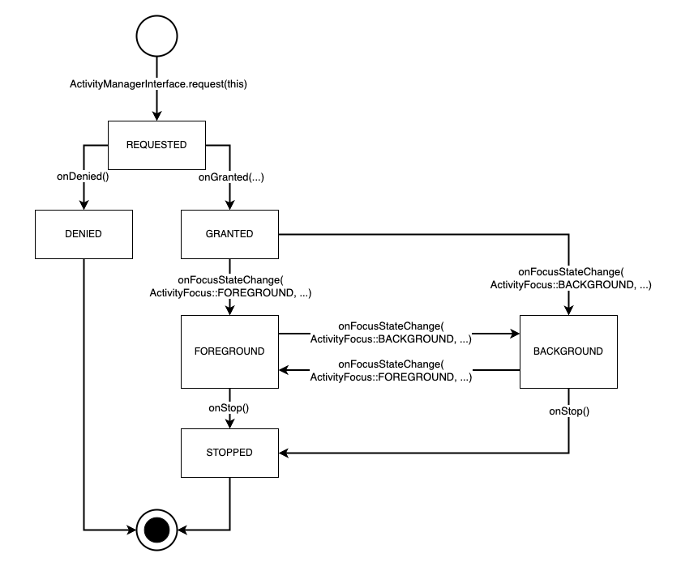

# Integrating with MAX Activities

## Activities

An Activity is a lifecycle for any non-Dialog activities (e.g., audio such as music) from an Agent or Device (referred to generally as an ‘actor’), and an actor should request an Activity before playing any audio which should be coordinated with other audio on the device. Whether or not audio should be coordinated is a decision to be made by the actor. For example playing a long piece of audio clearly should use an Activity as it might conflict with other audio. In contrast, playing a short sound effect for an action may not require one and could be played without coordination. When requesting an Activity, an `ActivityType` can be provided to classify the audio type. This will have some impact on how the request is handled and how it impacts the multi-agent experience. All Activities are either in the FOREGROUND or BACKGROUND. Only one Activity is in the FOREGROUND at a time, and has the full focus of the customer. All other BACKGROUND activities should modify their experience to make it clear they are not the primary experience (e.g. by pausing, lowering volume, or otherwise minimizing their audio output). The MAX library exposes the `ActivityManagerInterface` API for Agents and Devices to use Activities. Agents are provided an `ActivityManagerInterface` when registered with MAX, and Devices can get a `ActivityManagerInterface` through the `MAXInterface`. 
 

## Requesting an Activity

To start an Activity, a request is made to the `ActivityManagerInterface`. This is a request as not all Activities will be granted and some will be denied. To make a request the  `ActivityRequestInterface` is used with `ActivityManagerInterface`. Activities are expected to always provide a new handler for each instance of an Activity. This is because Agents and Devices can have multiple Activities active at once. Across all actors there can be one active Activity for each `ActivityType`. The request provides the `ActivityType` along with the handler to the `ActivityManagerInterface`.
 
As of version 0.4.0 there are three `ActivityType`s: COMMUNICATION, ALERTS, and CONTENT. These types also have a priority where CONTENT is the lowest, ALERTS is higher, and COMMUNICATION is highest. When more than one Activity is active they will both have different types. The active Activity with the highest type will be in the FOREGROUND and all the others will be in the BACKGROUND (there is one exception, when a Dialog is active all Activities are in the BACKGROUND). It is up to actors to correctly classify their audio to maintain the multi-agent experience customers expect. For example, if an actor plays music with an incorrect `ActivityType` of COMMUNICATION, the Activity will remain in the FOREGROUND state longer but if an Agent alarm is triggered during the playback the customer may not hear it above the music playing at full volume.
 
Once the correct `ActivityType` is chosen, the request can be made to `ActivityManagerInterface` with an  `ActivityHandlerInterface` (see Appendix A: Code 1). After the request the Activity lifecycle begins.
 
### Activity Lifecycle

 
 
The `onReady` callback initiates the lifecycle if the request is granted. Several important parameters are delivered via `onReady` to your `ActivityHandlerInterface`. 

* First is the `ActivityControllerInterface` (see Appendix A: Code 2). This controller is used to control the lifecycle of the Activity. 
* The `ActivityFocus` tells your activity if it is starting in the FOREGROUND or BACKGROUND. This state should be used the same as if it were given in a call to onFocusStateChanged.
* A `ControlRegistryInterface` is given to register Controls which impact the Activity. This use case is dived deep into in the [Integrating with MAX Controls, Universal Device Commands, Registering with an Activity](Integrating_With_MAX_Controls.md) use case section.
* Lastly `onReady` gives a `ExperienceControllerInterface`. This controller is used to modify the Experience presented to users when your Activity is active. More detail is given in the [Integrating with MAX Experiences](Integrating_With_MAX_Experiences.md) Documentation.

After `onReady` is called, the Activity will also receive a call to `onFocusStateChanged` with the current focus. `onFocusStateChanged` is called any time the focus changes, and can happen multiple times before the activity is finished. Activities do not change their own focus state. These focus changes are caused by other Activities or Dialogs being active at the same time as your Activity. Each transition should be implemented correctly to maintain the expected multi-agent experience for customers. 
 
When an Activity is finished `onStop` will be called. If the Activity is not already stopped it must stop in `onStop`. Activities can be finished in several ways:

* Using the `ActivityControllerInterface::stop` function will immediately stop the Activity. This is likely how your Activity will want to stop itself when it is done.
* The originating `ActivityRequestInterface` can be used with `ActivityManagerInterface::stop` to immediately stop the Activity. This is typically used when the component which requested the Activity determines it should be stopped before it is finished.
* The MAX Toolkit decides to stop your Activity, usually in response to another Activity of the same `ActivityType` being requested.

Once stopped or denied an Activity will never receive additional lifecycle events from the MAX Library. 
 

## Appendix A: Code References

### Code 1: ActivityHandlerInterface
```C++
#include <MultiAgentExperience/Activity/ActivityHandlerInterface.h>

namespace multiAgentExperience {
namespace activity {

class ActivityHandlerInterface {
public:
    virtual ~ActivityHandlerInterface() = default;

    /**
    * Called if the associated request is denied. Once denied the
    * activity will never receive another callback.
    */
    virtual void onDenied() = 0;

    /**
    * Called when the request is granted and the activity can start.
    * The provided ActivityControllerInterface,
    * ControlRegistryInterface, and ExperienceControllerInterface are
    * valid only until onStop is called. Once onStop is called these
    * interfaces will have no effect, and any registered Controls or
    * started Experiences will be automatically cleaned up.
    */
    virtual void onReady(
        std::shared_ptr<ActivityControllerInterface> activityController,
        multiAgentExperience::activity::ActivityFocus focus,
        std::shared_ptr<control::ControlRegistryInterface> controlRegistry,
        std::shared_ptr<experience::ExperienceControllerInterface> experienceControl) = 0;

    /**
    * The focus changed to a new focus value.
    *
    * @param focus - The current focus of the activity.
    */
    virtual void onFocusStateChange(multiAgentExperience::activity::ActivityFocus focus) = 0;

    /**
    * The activity must stop immediately. Any registered Controls or
    * started Experiences will be automatically cleaned up.
    */
    virtual void onStop() = 0;
};
}
```

### Code 2: ActivityControllerInterface
```C++
#include <MultiAgentExperience/Activity/ActivityControllerInterface.h>

namespace multiAgentExperience {
namespace activity {

/**
* The ActivityControllerInterface allows control over the current
* activity's lifecycle.
*/
class ActivityControllerInterface {
public:
    virtual ~ActivityControllerInterface() = default;

    /**
    * Immediately stops the activity.
    */
    virtual void stop() = 0;
};

}
}
```
