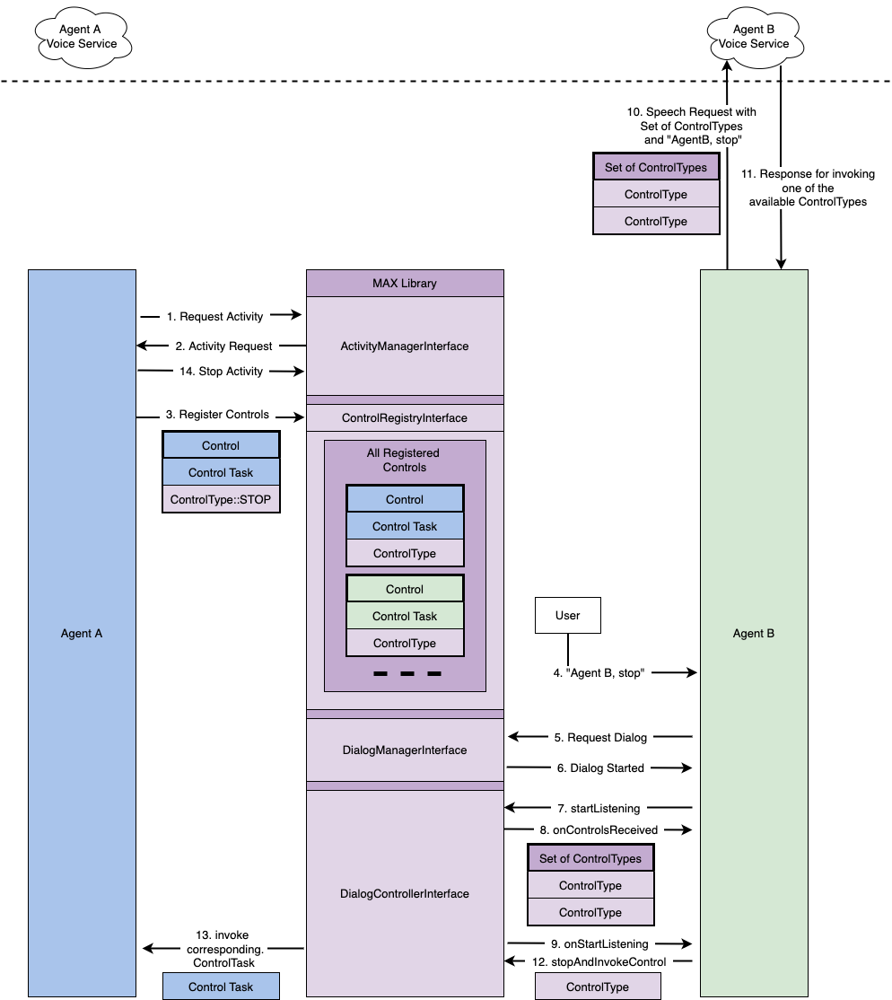

# Integrating with MAX Controls

## Controls
A Control is an action with a `ControlType` matching a supported Universal Device Command (UDC) on the device. Controls are used to:

* Register actions for other Agents to access for UDCs
* Invoked when a user request is recognized as a UDC request

They also contain the only data shared from MAX Library to other Agents when making voice requests. Specifically the `ControlType` of all currently available Controls are shared with an Agent just before the LISTENING state of a Dialog. This set of `ControlType`s must be the only data necessary for your speech recognition to evaluate if the user request was for your Agent own features, or for your Agent to take action on an available UDC.

Access to Control APIs are restricted to Actors which have active Dialogs and Activities in certain states. These restrictions are always in place to help the developer meet the requirements in the Multi-Agent Design Guide Version.

This section is not going to focus on all the use cases for Controls, instead it will explain the behavior of the related APIs. For a deep dive into the different use cases see **Universal Device Commands** below.

### Control
The Control is a simple wrapper around an action and a `ControlType`. The action is a `std::function<void()>` which will be invoked when MAX determines your `Control` has been invoked. This function can be provided in several ways including a function pointer or a lambda. Remember that MAX is designed so that the `ControlType` of a `Control` is the only information exposed to other Agents.

### ControlRegistryInterface
The `ControlRegistryInterface` is used to register a set of `Control`s which impact a given Activity or Dialog. These use cases are explained in detail in the **Universal Device Commands** section. The registry has a single API `update(std::set<Control>)`. The set contains a single `Control` per `ControlType`. The registry can be used to update the available `Control`s any number of times, and completely replaces any previously registered `Control`s each time. This API should only ever be used to register `Control`s which impact the Activity or Dialog which was used to get the registry. If it is used to register a `Control` outside of the current lifecycle, the `Control` may be potentially deregistered before or after it should be. This is because the `ControlRegistryInterface` is bound to the lifecycle which created it. Any `Control`s still registered when the Activity or Dialog is finished will automatically be deregistered. This automatic deregistration is convenient, but update can be used to set an empty set at any time to manually deregister. Once the associated lifecycle is finished, the registry will no longer make `Control`s available for other Agents and should be discarded.

### ControlReceiverInterface
The `ControlReceiverInterface` is used to pass available `Control`s to the Agent when a Dialog is granted and just before it is set to LISTENING state.

### DialogController Control Invocation
The ability to invoke `Control`s is limited to Agents with an active Dialog, and therefore access to a `DialogControllerInterface`. All of the detail for how to request a Dialog and use it for UDCs can be found between the **Universal Device Commands** section. When either `DialogControllerInterface::invokeControlAndStartSpeaking(ControlType)` or `DialogControllerInterface::stopAndInvokeControl(ControlType)` are used the same thing happens. The given `ControlType` is checked against the registered `Control`s. If there are multiple `Control`s with the same `ControlType`, the conflict is always resolved by invoking the highest priority first.

The highest priority is determined by how the `Control` was registered. The highest possible priority is the `Control` registered with a `ControlRegistryInterface` given to a Dialog. If there are no Dialog Controls matching the `ControlType`, the Activity Controls are invoked in order of `ActivityType` COMMUNICATION, then ALERTS, and finally CONTENT. This priority is used as it matches the priority of customer experience.

For example, consider two Activities one on ALERTS and the other on CONTENT. Given the behavior of Activities, the Activity of ALERTS type will be in the FOREGROUND and have the primary experience for the customer. If the customer asks for your Agent to stop, and this is determined to be a UDC invocation, stopping the primary experience for the customer will surprise them the least. See **Universal Device Commands** for more detail.


## Universal Device Commands
The Multi-Agent Design Guide (MADG) defines Universal Device Commands (UDCs) as: *those 'commands' and 'controls' that a customer may use with any compatible agent to control certain device functions, even if the agent was not used to initiate the experience*. Like other parts of the MADG, the MAX Library does not interact with every part of UDCs. Specifically, it interacts only with the Device side features of registering and invoking 'controls', and has no part in recognizing the 'commands' given by users to invoke the controls. Both Agents and Devices (referred to generally as ‘actors’) can both register and invoke UDCs. To invoke UDCs the command from the user must be recognized. This may be through a speech request with an Agent, or a Device may present some UI (e.g. a ‘stop’ button) to users which can invoke UDCs when pressed. To facilitate this MAX provides APIs which allow actors to register controls for other actors to take action on.

For recognizing UDCs during speech requests, MAX Library will give an Agent:

* A set of available Controls, registered for active Activities, from other Agents, during a Dialog
* A registry to make Controls available to other Agents during their requests
* Options to invoke Controls once user speech requests have been recognized

To make it clear only Device controls are managed by MAX, the library always refers to its part of UDCs as Controls.


### Registering Your Actors' Active Controls

All Controls are made available through a `ControlRegistryInterface`. There are only two ways to get access to one of these registries, either by using an Activity or, in less common cases, a Dialog.

#### Registering with an Activity
This is how most Controls will be registered, as most impact the types of experiences Activities are used for. The full description of Activities is above, and should be reviewed for full context. Here we are only concerned with the onReady lifecycle callback of the `ActivityHandlerInterface`. This is called when a requested Activity is allowed to start, and part of being granted is a reference to a `ControlRegistryInterface`.


The `ControlRegistryInterface` is bound to the lifecycle of this particular Activity. It can be used to update the Controls associated with this Activity until it is stopped. Once it is stopped, any registered Controls are automatically unregistered. As it is bound to this Activity, it should never be used to register Controls for another Activity. While Controls are registered, any Actor who can access Controls will have access to the `ControlType` of the Controls only, and never have access to which Actor registered them.

#### Registering with a Dialog
Registering with a Dialog is expected to be applicable less often. This is because the different lifecycle of Dialogs and the Barge-In-ability of Dialogs limits when UDCs which may apply. The one exception is in the SPEAKING state. What an Agent speaks about is not restricted in any way by the MAX library. If it makes sense that some UDCs can take action on the content of the speech then they can be registered (e.g. using a physical or software ‘next’ button on the Device to skip some content in the Dialog).

Let’s look at how Barge-In makes UDCs less applicable to Dialogs. UDCs are invoked in two general ways, either through a user voice request to an Agent, or through a Device UI ingress like a button. Since Dialogs are not Barge-In-able during LISTENING or THINKING, it is not possible for a user to make a voice request to use a UDC. In addition, since SPEAKING is Barge-In-able, any voice request during SPEAKING to another Agent will interrupt the Dialog immediately, resulting in any UDCs which could act on the SPEAKING dialog redundant. This leaves Device UI as the only reasonable way to apply a UDC to an active Dialog.

Like registering with an Activity, a `ControlRegistryInterface` is given to the `SpeakingStateHandlerInterface` when it is granted and can start speaking through `onStartSpeaking`:


The given registry is also bound to the lifecycle of this SPEAKING state. Once the SPEAKING state is stopped in `onStopSpeaking` any registered controls will automatically be unregistered.


### Accessing All Agents’ Active Controls
Recognizing a voice command as a UDC command requires some state about what is happening across the Agents on a Device. To support this the MAX library makes the ControlTypes of UDCs available during a voice request available to Agents. It does this by limiting access to this state to a Dialog just before the LISTENING state. They are delivered in the `onControlsReceived` callback of the `ControlReceiverInterface`.

This is the only way to get access to the available Controls. Notice the ControlType does not give the listening Agent any data about what or which Agent has registered the Control. These restrictions are in place to make an Agent using the MAX library automatically limit the exposure of their data to other Agents. The set of ControlTypes will not be updated, and should not be used outside of the originating speech request.

### Invoking Another Agents Active Control
Once a UDC is identified as the users request, an Agent must take action on the corresponding Control. This is made available only to Dialogs which are currently active. Specifically Controls can be invoked using the current Dialog’s `DialogControllerInterface`. There are two ways to do so which should match all UDC invocation use cases: UDCs which require a verbal response, and UDCs which have no verbal response.

For UDCs which require a verbal response there are also two options, either the UDC is acted on immediately and the verbal response is merely confirmation, or the verbal response precedes the UDC actually taking action.

#### Example A
In this example the Control is immediately invoked and there is no means for Barge-In to interrupt the invocation.
```C++
/*
* During an active Dialog a UDC is invoked. For this UDC the
* Agent invokes it immediately and confirms verbally.
*/
dialogController->invokeControlAndStartSpeaking(controlTypeToInvoke);


// MAX library immediately invokes the control and calls
// onStartSpeaking for the registered SpeakingStateHandler
void MySpeakingControl::onStartSpeaking(
    std::shared_ptr<DialogControllerInterface> dialogController,
    std::shared_ptr<ExperienceControlInterface> experienceController,
    std::shared_ptr<ControlRegistryInterface> controlRegistry) {
    // start speaking, for example "stopping"
    // somehow determine speech is over, finish the Dialog
    dialogController->stop();
}
```

#### Example B
In this example, the control is invoked after the speech, and thus the Dialog could be barged in on before the control is invoked, making it impossible to invoke the control.

```C++
/*
* During an active Dialog a UDC is invoked. For this UDC the
* Agent speaks first.
*/
dialogController->startSpeaking();

// MAX library calls onStartSpeaking for the registered
// SpeakingStateHandler
void MySpeakingControl::onStartSpeaking(
    std::shared_ptr<DialogControllerInterface> dialogController,
    std::shared_ptr<ExperienceControlInterface> experienceController,
    std::shared_ptr<ControlRegistryInterface> controlRegistry) {

    // start speaking, for example "stopping"
    // somehow determine speech is over, finish the Dialog
    dialogController->stopAndInvokeControl(controlTypeToInvoke);

    // the Dialog will be stopped and then the control is
    // immediately invoked.
}
```

For UDCs with no verbal response the implementation is simpler. At any time in the Dialog if a UDC is meant to be invoked, the Dialog can be stopped with the Control to invoke. For example:

#### Example C
In this example the UDC response requires no verbal response, the action is immediately taken.
```C++
dialogController->stopAndInvokeControl(controlTypeToInvoke);
```

### Invoking Agents' Controls

It is not possible to invoke your Agent's controls in the same way as others. Only registered controls corresponding to those activities in foreground from other agents are passed to you. When your Agent has an Activity with a STOP `Control` registered, it can be stopped by any other Agent using MAX. If a customer asks your Agent to ‘stop’, default practice for your Agent should be to recognize that it has something stoppable directly without going through the UDC feature. The reason for this is your Agent should be able to disambiguate a customers intention in these situations. For example, if there are two Agents, and each has a STOP `Control` for an active Activity, the UDC invocation will stop the higher priority Activity first. If that Activity was not yours then it may break the customers expectation, since they did ask your Agent to stop. While this may be ok in some cases, it is better to bias towards assuming the customer chose your Agent purposefully and stop your Agent’s Activity directly.

## Appendix A: UDC Data Flow and Implementation Details

### Diagram 1: UDC Control and Data Flow

Diagram 1 is meant to capture the control and data flow which happens when a Universal Device Command is used with the MAX Library. It contains a description for each step in the process including a deeper dive into how it is implemented at critical points. For a precise sequence diagram look at Diagram 2.



#### Notes
* AgentA is blue, AgentB is green, and any MAX Library component is a shade of purple.
* The color coding for the diagram is meant to show which data is provided by which part of the Multi-Agent Experience. For example each Control in the Diagram is colored matching the Agent which registers the Control. The `ControlType` in these Controls however matches the color of MAX Library as the set of defined shared UDCs is within the MAX Library. Any `ControlType` value does not indicate which Agent maps to that Control. Only MAX Library knows by maintaining state about how the Controls were registered. It is important to recognize that no AgentA data is shared with AgentB, and no AgentB data is shared with AgentA. This will make it clear how it manages this data, and how it impacts the user experience.
* The area inside the `ControlRegistryInterface` is showing the storage of all currently registered across all Agents, not just the ones AgentA is currently registering in the example. The AgentB Control shown inside the `ControlRegistryInterface` is meant to clearly show that multiple Agents Controls will be registered at the same time.
* **AgentA has some experience which plays audio (say a Timer is triggered) and wants to ensure it is coordinated with other Agent experiences, and makes the STOP UDC available to other Agents. It first asks for an Activity to be ready to coordinate audio and to get access to a registering Controls.**
* **The Activity is granted and onReady is called delivering a `ControlRegistryInterface` to AgentA.**
     This instance of ControlRegistryInterface is bound to the Activity which was just requested. It must only be used to register Controls which are related to any other Agent experience. It is bound simply by MAX Library keeping track of which Activity it was created for, and in turn which Agent created the Activity.
* **AgentA use the ControlRegistryInterface::update() function to update the set of Controls available for this Activity.**
* **The User wakes up AgentB with the wake word ‘AgentB’.**
* **AgentB requests a Dialog for its interaction with the User.**
* **The Dialog request is granted and control with respect to active Activity in foreground is cached, if it is found to be from another Agent.**
* **The Dialog is started.**
* **AgentB sets the state of the Dialog to LISTENING. Meanwhile the User has continued to ask AgentB to ‘stop’.**
* **The set of available ControlTypes is passed through a previously registered ControlReceiver to AgentB.**
  The set of available Control types is merely the union of all ControlTypes for the active Activities of other Agent (AgentA, in this case). An Agent is expected to make a choice of whether or not the User wants to invoke one of them.
* **When LISTENING starts, AgentB sends this set of ControlTypes to its voice recognition component (which in this example is in a cloud service).**
* **The voice recognition system recognizes the User said ‘stop’ and checks if stop should take some action within the AgentB features, determines there is nothing and therefore checks against available UDC ControlTypes. ControlType::STOP is included, so it returns a message to AgentB on the device to invoke the UDC for ControlType::STOP.**
     Remember MAX Library is not involved in any way in this recognition and deciding how to take action. It merely provides some context to what the multi-agent experience is. It is the Agents responsibility to use this context to take the best action for the user.
* **AgentB has nothing to respond with other than invoking the UDC, so it uses `DeviceControllerInterface::stopAndInvokeControl(ControlType::STOP)` to both end its Dialog and invoke the UDC.**
* **MAX Library determines which control should be invoked based on the given ControlType. In this case the only Control registered with a STOP ControlType is from AgentA & the activity is still active. So it executes the ControlTask within the registered Control to invoke the UDC.**
     MAX Library checks whether the control registered for the Activity in foreground during dialog invocation is still active. If found so, decision is made to act on the registered Control.
* **AgentA’s ControlTask registered for its Activity is invoked. It is given no data about why or how it was invoked, but trusts MAX Library and stops its Activity’s content and removes it from the MAX Library via the `ActivityManagerInterface`. This automatically deregisters the Controls in the `ControlRegistryInterface` associated with the Activity.**
     Once the Activity is stopped, either by the Agent using the `ActivityManagerInterface::release` function or it is stopped by MAX Library for another reason (through `ActivityHandlerInterface::onStop`), all Controls registered with this `ControlRegistryInterface` will be automatically deregistered. This is done again by simple keeping track of which `ControlRegistryInterface` was used to register each Control, and when an Activity is stopped removing all Controls registered with the `ControlRegistryInterface` associated  with the Activity. Remember Agents are welcome to use `ControlRegistryInterface::update` to add, change, or remove any Controls while the Activity is active, the automatic cleanup just makes it easier to ensure each Agent is not leaking Controls over time.

### Diagram 2: Precise Sequence of MAX Library Usage When Invoking UDCs


Everything which looks like a function call maps to an existing function either implemented by an Agent implementation or the MAX Library. Any other text is generally describing what task needs to be implemented by an Agent. The sequence shown is only one example, and may differ from a real Agent’s logic.

