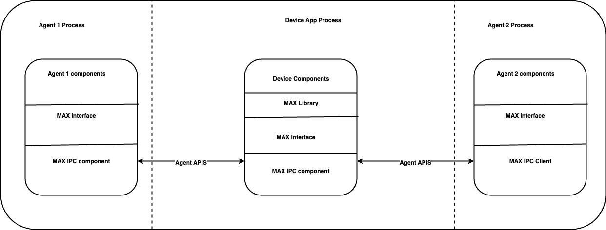

## MultiAgentExperience IPC

Agents and device makers should build an IPC solution so that the part of an agent that interacts with MAX can reside in the MAX process and the critical components part of the agents can be a separate process. This version of MAX implements an IPC solution to enable compartmentalization of each agent in separate processes, enhancing security. MAX IPC solution attempts to make this task simpler by providing an IPC implementation.

The current implementation of the MAX IPC is done using the gRPC library. Using the MAX IPC the following solution can be achieved.

It is highly recommended to separate the agent processes to ensure the isolation of the critical components in their respective process.

The MAX IPC component uses the gRPC to run a server.  The server is run on the Agent process as well as the Device App process. API communication to the Device App process uses the server hosted in the Device App process and any callbacks or communication done to the Agent 1 process uses the server hosted in the Agent 1 process. 
