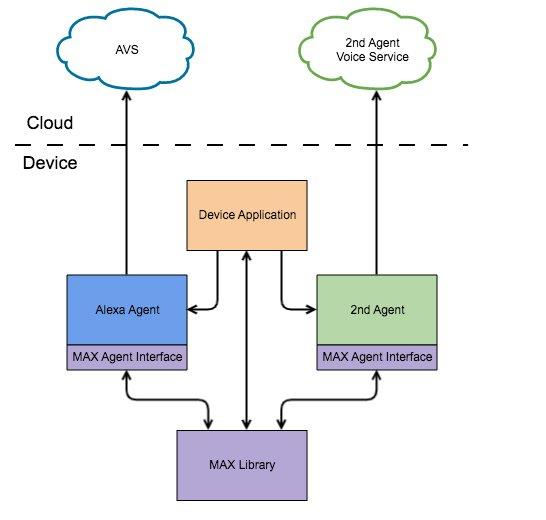

# MAX Toolkit Overview

## Multi-Agent Experience Toolkit Overview

The Multi-Agent Experience (MAX) Toolkit from Amazon contains resources to create a multi-agent experience on a device that meets much of the baseline guidance in the [VII Multi-Agent Design Guide](https://developer.amazon.com/en-US/alexa/voice-interoperability/design-guide). The Toolkit contains:

* The MAX Library, which enables Agents and Devices to create multi-agent experiences.
* The MAX Computer Agent as a sample implementation of an Agent for use in a multi-agent experience.
* A patch for the AVS Device SDK (v1.23.0) which enables integration with the MAX Library.
* The MAX Sample Application which contains a demo of a complete multi-agent experience with Alexa and Computer.
* Documentation on the MAX Library, how to use it with your agent and device, and a glossary of terms.

MAX Toolkit also includes a [Glossary](Glossary.md), which defines terms relevant to multi-agent experiences. Refer to it for definitions and additional context about concepts in MAX documents.

## Overview of the MAX Library
MAX Library exposes client-side APIs to enable control of multiple Agents. These APIs enable developers to coordinate multi-agent experiences both visually and audibly, implement Universal Device Commands (UDCs) with minimal data shared between agents, and supports Agent Transfer experiences between agents. It is the responsibility of the agent-makers and device-makers to use the MAX Library APIs to provide the optimal multi-agent experience.

The diagram below illustrates the interactions between Agents, Device applications, and the MAX Library. The Device application represents the software owned by a Device-maker to initialize the MAX Library and Agents. The Multi-Agent Sample Application is a concrete example of a Device application. Through the use of MAX Library, Agent experiences are coordinated through the use of common focus and activity managers. The Device application is responsible for rendering these experiences and handling user input. Both Agents and the Device application make calls to and from the MAX Library. The Device application also makes calls to Agents for operations that do not require use of the MAX Library. For example, handling a button which triggers a specific Agent’s feature.

 It’s important to note that:

* Agents never directly call each other. They must use  the MAX Library for use cases that require interaction such as for Universal  Device Commands.
* The MAX Library does not interact with the Agent  backend services. It only interacts with the device-side implementation for each Agent.
* Multiple Agents may also share the same backend service.

## Further Documentation for MAX Library Use Cases

* To build and run the Sample Application refer to the [MAX Sample Application Getting Started Guide](MAX_Sample_Application_Getting_Started_Guide.md).
* Both Agents and Devices developers should refer to the [MAX Library README](../MAX/README.md) for instructions on building the MAX Library.
* Agent developers should start with the [Integrating an Agent with MAX Library](Integrating_An_Agent_With_MAX_Library.md) document. This documentation goes over all Agent use cases, MAX Library API usage, and multi-agent features enabled by integration.
* Device or application developers should start with [Integrating a Device with MAX Library](Integrating_A_Device_With_MAX_Library.md).
* Agent and device or application developers should then read [Integrating with MAX Controls](Integrating_With_MAX_Controls.md), [Integrating with MAX Activities](Integrating_With_MAX_Activities.md), and [Integrating with MAX Experiences](Integrating_With_MAX_Experiences.md).
* If an agent-maker is using a wake word, both the agent-maker and device-maker should also read through [Overview of MAX Sample Application and Multiple Wake Word Engines](Overview_Of_MAX_Sample_Application_And_Multiple_Wake_Word_Engines.md).
* A Glossary of terms used across the documentation can be found in the [MAX Glossary](Glossary.md).
